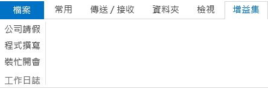
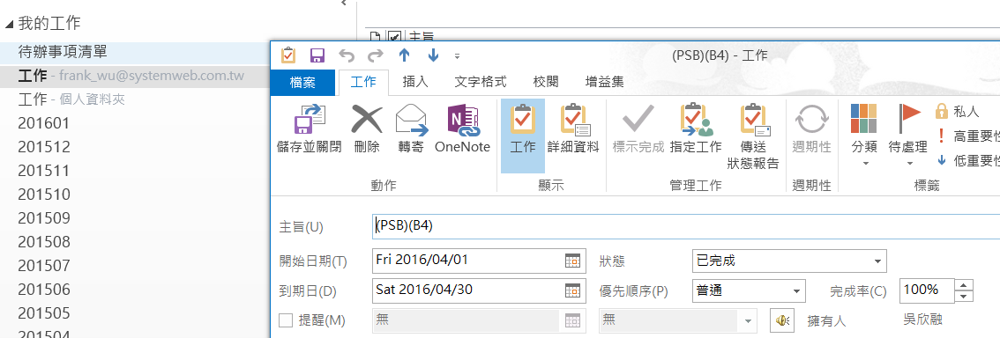

#SystemwebMonthlyReport

本 Add-In 僅提供[博暉科技](http://www.systemweb.com.tw/) 同仁快速撰寫每月工作日誌使用。

##How to install

1. 下載[最新版本](https://github.com/hsinjungwu/SystemwebMonthlyReport/releases/download/latest/SystemwebMonthlyReport.zip)。
2. 解壓縮並執行 `setup.exe` 即可。

##How to uninstall

1. 進入 **控制台\所有控制台項目\程式和功能** 移除 `SystemwebMonthlyReport` 即可。

##How to use

安裝完後，可以看到 Outlook 多了一個 Ribbon 如下圖

點選各個按鈕即可在 **預設資料夾** 中產生工作日誌內容

接著自行調整時數與專案分類，再拖曳至正確位置即可。